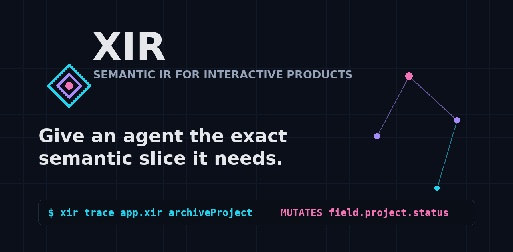
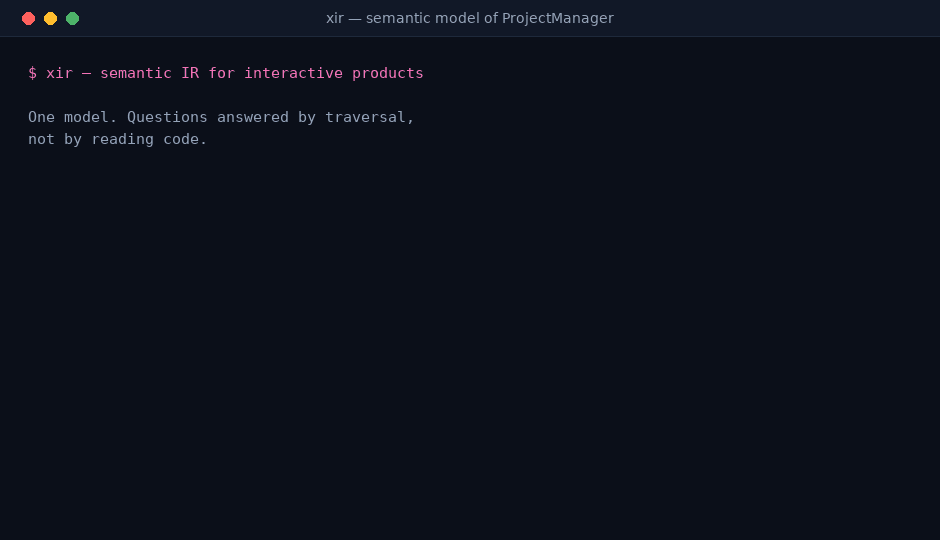
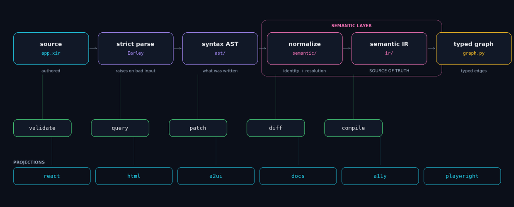
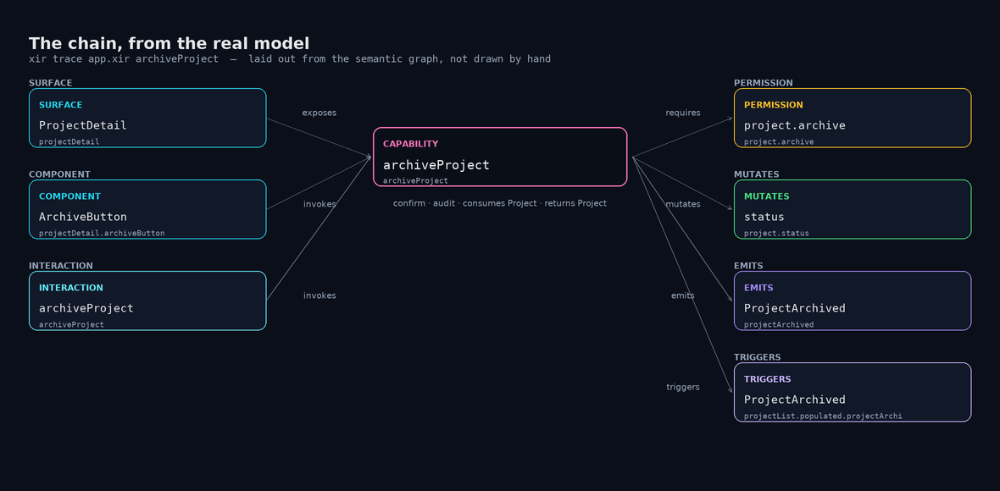

<p align="center">
  <a href="docs/logo.svg"></a>
</p>

<h1 align="center">XIR — the semantic IR for interactive products</h1>

<p align="center">
  <b>Give an agent the exact semantic slice it needs.</b>
</p>

<p align="center">
  <a href="#demo">Demo</a> ·
  <a href="https://github.com/ZakLr/XIR">GitHub</a> ·
  <a href="https://github.com/ZakLr/XIR/blob/main/docs/AGENTS.md">Agent guide</a> ·
  <a href="https://github.com/ZakLr/XIR/blob/main/docs/REPO.md">Repo guide</a> ·
  <a href="#roadmap">Roadmap</a>
</p>

<p align="center">
  <a href="https://github.com/ZakLr/XIR/actions/workflows/ci.yml"></a>
  <a href="LICENSE"></a>
  <a href="https://pypi.org/project/xir-core/"></a>
  
  
  
</p>

<p align="center">
  
</p>

---

## The problem

An interactive product lives as disconnected artifacts: **code, screenshots, Figma,
prose, schemas**. An agent reading all of that burns tokens, guesses at intent, and —
worst — cannot tell a *relationship* from a *coincidence of words*.

It greps for `archiveButton`, finds a `<div>`, and guesses what it does.

## The idea

**A behavioural question is a traversal, not a search.**

XIR is a compiler-grade semantic intermediate representation. You author what the
product *means* and how it *behaves*; the model projects to React, HTML, A2UI, docs,
accessibility metadata and Playwright tests.

```text
$ xir trace app.xir archiveProject
CAPABILITY: archiveProject
  REQUIRES: project.archive      [permission.project.archive]
  MUTATES:  status               [field.project.status]
  EMITS:    ProjectArchived      [event.projectArchived]
  EXPOSED BY: ArchiveButton      [component.projectDetail.archiveButton]
  STATE:   confirming            [state.projectDetailActions.confirming]
```

Every line is a typed edge, not a string match.

## Demo



Real commands, real output. Watch the last one: the patch is **rejected and rolled
back** because something still references the capability.

## Install

```bash
pip install xir-core
```

> The distribution is `xir-core` because `xir` on PyPI is taken by an unrelated
> experiment IR. The command is `xir`, the import is `xir`, the extension is `.xir`.

## Quickstart

```bash
xir validate examples/project-manager/app.xir     # is the model coherent?
xir trace    examples/project-manager/app.xir archiveProject
xir query    examples/project-manager/app.xir "who can archiveProject"
xir compile  examples/project-manager/app.xir --target react --out src/App.jsx
```

## How it works



```text
source .xir
  -> strict parse          invalid input raises; it never degrades silently
  -> syntax AST            literally what the file said
  -> normalization         owns identity and reference resolution
  -> semantic IR           THE source of truth
  -> typed graph           every edge has a relation
  -> validate / query / patch / diff / compile
```

Nothing downstream of the IR reads the syntax AST. That separation is what keeps
identity, validation and queries consistent.

## The payoff



*Rendered from the actual semantic graph of `examples/project-manager` — not drawn
by hand. If the ontology changes, this picture changes with it.*

| Without a model | With XIR |
|---|---|
| "Where is archiving implemented?" → grep 40 files | `xir trace` → one traversal |
| "Can a member archive?" → read every route guard | `xir query` → the permission edge |
| "What breaks if I rename this?" → hope | `xir diff` → identity is preserved |
| "Is this screen missing an error state?" → guess | `xir validate` → `UNREACHABLE_STATE` |
| "Delete this capability" → dangling refs | `xir patch` → rejected, names every dependent |

## Why not the alternatives

| Approach | Why it is not enough |
|---|---|
| **Read the code** | relationships are implicit and distributed across files |
| **Design tools (Figma)** | pixels, not intent, permissions or flows |
| **UML / statecharts** | formal but not compiled, not agent-retrievable, drifts from code |
| **A2UI / card JSON** | rendering only — no capabilities, no state machines |
| **OpenAPI / JSON Schema** | data and contracts only — no UI, no flows |
| **MCP tool lists** | the wire protocol, not the product behind it |
| **Prose specs** | no stable identity, no diff, no validation |
| **XIR** | the semantic layer that connects all of the above |

Full analysis: [`research/differentiation.md`](research/differentiation.md).

## What you get

- **Stable identity** — renaming a thing does not destroy it; ids survive, and every
  reference is rewritten atomically or the patch rolls back.
- **Validated transactions** — a patch never leaves the model partially invalid, and
  `remove` refuses while anything still points at the target.
- **Honest uncertainty** — `requirement` vs `observation` vs `inference`, with
  confidence and evidence. An inference may never claim `confirmed`.
- **Round-trip stability** — parse → serialize → parse is semantically equivalent.
- **Multi-resolution context** — L0..L6, so an agent loads the slice it needs, not
  the whole model.

## Examples

| Example | Shows |
|---|---|
| [`project-manager`](examples/project-manager/app.xir) | the full ontology: goals, permissions, events, state machines, interactions, invariants, evidence |
| [`clinic`](examples/clinic/app.xir) | a domain extension — healthcare |
| [`ecommerce`](examples/ecommerce/app.xir) | confirmation and authorisation |
| [`todo`](examples/todo/app.xir) | the minimal core |
| [`dashboard`](examples/dashboard/app.xir) | states and a refresh flow |

## Documentation

- **[docs/AGENTS.md](docs/AGENTS.md)** — using XIR: command surface, traversal recipes, patch workflow, conventions
- **[docs/REPO.md](docs/REPO.md)** — this repository: layout, how to run it, how to contribute
- **[docs/](docs/README.md)** — the index
- [`spec/`](spec/) — grammar, ontology, semantics, semantic graph, queries, patches, validation
- [`research/`](research/) — landscape, related systems, competitors, differentiation

## MCP server

`xir-mcp` exposes a model as nine tools, so an agent traverses it instead of grepping it.

```bash
pip install 'xir-core[mcp]'
xir-mcp path/to/app.xir
```

```jsonc
// e.g. ~/.config/opencode/opencode.json
{
  "mcp": {
    "xir": {
      "type": "local",
      "command": ["xir-mcp", "/abs/path/to/app.xir"],
      "enabled": true
    }
  }
}
```

| Tool | Answers |
| --- | --- |
| `xir_summary` | what the product is, projected at level 0–6 |
| `xir_validate` | every semantic inconsistency, before anything is trusted |
| `xir_trace` | the full behavioural chain for a capability |
| `xir_inspect` | one node and its typed relations |
| `xir_query` | routed query: who-can, affected, what-happens, show |
| `xir_follow` | structural traversal along one edge relation |
| `xir_diff` | semantic diff between two models |
| `xir_compile` | react, html, a2ui, docs, a11y, playwright, tests, xir |
| `xir_health` | validity, separated from how well the model is specified |

The tools are thin: they route to the same library the CLI uses, so the MCP answer and
`xir trace` are the same answer. `xir-mcp --list-tools` prints the full JSON schema.

## Agent skill

[`skills/xir/`](skills/xir/) packages all of this as an installable agent skill.

```bash
cp -r skills/xir ~/.config/opencode/skills/     # or ~/.claude/skills/
```

```bash
$ python skills/xir/scripts/xir_health.py examples/project-manager/app.xir
  coverage:
    capabilities_typed                 2/2
    machines_with_transitions          3/3
    flow_steps_fully_specified         2/2
  round-trip: stable
  findings: none
```

The report shows the distinction that matters: a model can validate clean and still be
barely specified. That gap is what the coverage lines expose.

## Status and honesty

**v0.3, alpha.** Solid: the semantic model, identity, validation, queries, atomic
patches, round-trip stability, one real compiler target.

**Not proven:** that XIR makes an LLM agent faster or more correct. No blinded agent
trial has been run. Benchmarks are labelled `MEASURED` / `SIMULATED` / `INFERRED` and
[the report](benchmarks/report.md) states exactly what is and is not measured. We do
not claim token savings for agents as fact.

## Roadmap

Shipped: semantic IR separated from the AST · stable ids and identity-preserving
rename · rename-aware diff · state machines, interactions, permissions, events, flows ·
atomic validated patches · real React target and semantic Playwright · model health ·
**agent skill** · **MCP server** · **documentation site**.

Next: **blinded agent evaluation** — the missing proof — then extraction from an
existing codebase, a visual editor, and more compiler targets.

The full roadmap, including what is deliberately *not* planned, is in
[docs/ROADMAP.md](docs/ROADMAP.md). Open questions:
[`OPEN_QUESTIONS.md`](OPEN_QUESTIONS.md).

## Community

- [Discussions](https://github.com/ZakLr/XIR/discussions) — questions, ontology design, show your models
- [Issues](https://github.com/ZakLr/XIR/issues) — bugs and proposals
- [Security](https://github.com/ZakLr/XIR/security) — report privately

Before opening an issue, read [docs/COMMUNITY.md](docs/COMMUNITY.md) — it explains what
makes a report actionable, and what the single most useful contribution would be.

Contributing: [`CONTRIBUTING.md`](CONTRIBUTING.md) ·
Changelog: [`CHANGELOG.md`](CHANGELOG.md) · Decisions: [`DECISIONS.md`](DECISIONS.md) ·
[Website](https://zaklr.github.io/XIR/) · [Star history](docs/STAR_HISTORY.md)

## License

**AGPLv3+.** Free to use, modify and share. If you run a modified version as a network
service you must offer its source to your users (§13). A deliberate choice: a semantic
layer is most valuable when improvements flow back. See [`LICENSE`](LICENSE).
